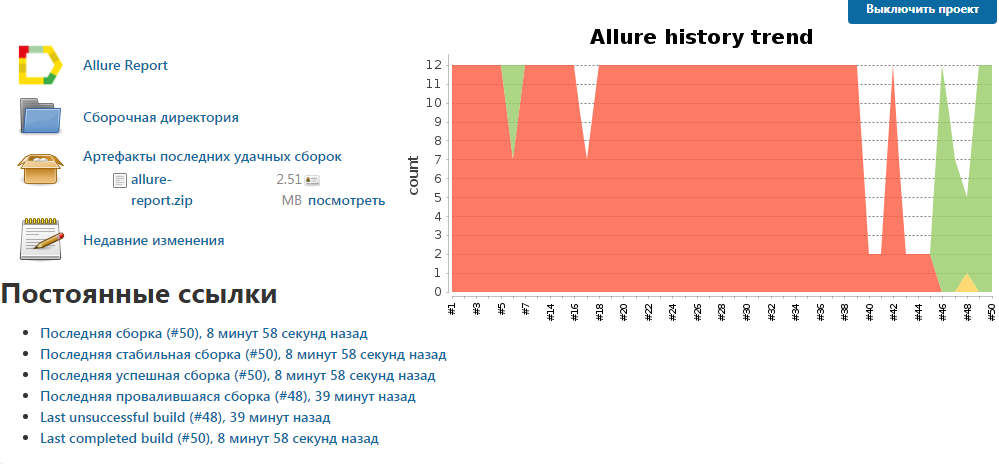
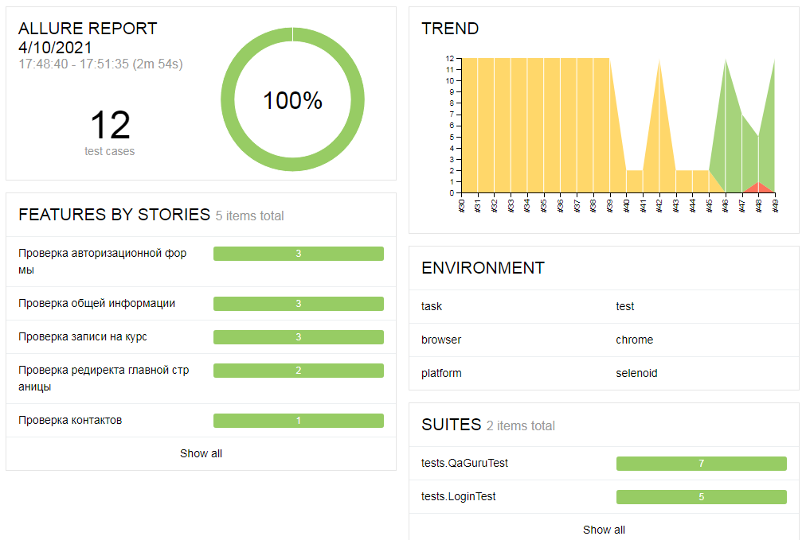
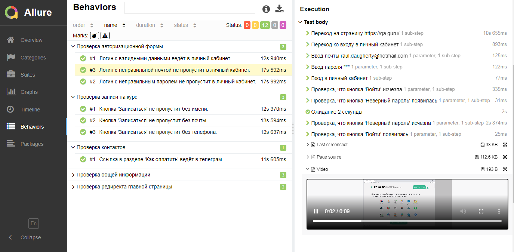
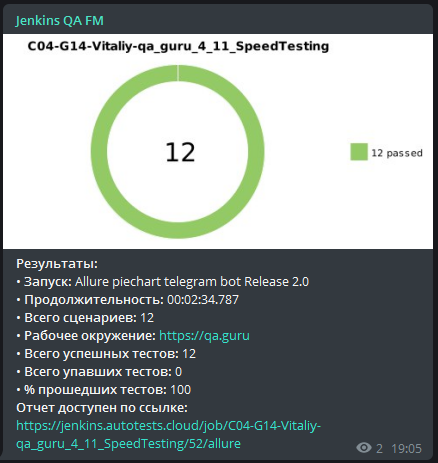

Тестирование сайта qa.guru
=============
[Главная страница](https://github.com/Gorbatenko/qa_guru_4_home_11/blob/master/src/test/java/tests/QaGuruTest.java)
-------------
- Проверка записи на курс
- Проверка контактов
- Проверка общей информации

[Вход в аккаунт](https://github.com/Gorbatenko/qa_guru_4_home_11/blob/master/src/test/java/tests/LoginTest.java)
-------------
- Проверка авторизационной формы
- Редирект на главной странице

Стэк технологий
-------------
Java, Gradle, Junit5, Selenide, Allure Reports, Jenkins, Selenoid, Telegram Bot, Owner.

[Jenkins-сборка](https://jenkins.autotests.cloud/job/C04-G14-Vitaliy-qa_guru_4_11_SpeedTesting/)
-------------

> Jenkins-сборка.

> Общий дашборд прогона тестов.

> Шаги прохождения тестов.

> Telegram-оповещение.

